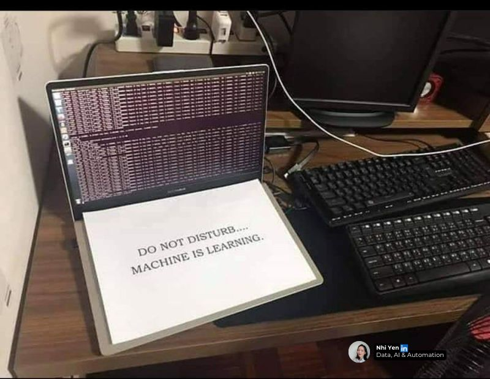

<h1 align="center">
    
</h1>
<h2 align="center"> ´MSc Behavioural Data Science | AI, ML & Data Science | Experimenting, Learning, Delivering 🔭´ </h2>

### 🤫 _Shhh… Quiet please..._

---

  

---

## 💡 About Me  
- 🔭 Currently working on: **AI-driven projects, machine learning models, and data pipelines**  
- 🌱 Currently learning: **Clean code, OOP & SOLID best practices, MLflow, Docker, and intelligent agents**  
- 🎯 Goal: **Build interpretable, scalable, and impactful AI systems**  
- ⚡ Fun fact: I sometimes explain life decisions using confusion matrices 🤖  

---

## 🛠️ Tech & Tools  

**Programming**  
🐍 Python | 📊 R | 💾 SQL  

**Data Analysis & Machine Learning**  
📈 Hypothesis (A/B) Testing | 🤖 scikit-learn | 🎯 Optuna | 🔍 Clustering | 🧩 Model Explainability (SHAP)  

**AI & RAG**  
🧠 TensorFlow | 🔥 PyTorch | 🤗 Hugging Face | 🔗 LangChain | 🗃️ ChromaDB | 📑 Docling | 📂 Unstructured  

**Data Processing & Visualization**  
🔢 NumPy | 🐼 Pandas | 🔄 Tidyverse | 📊 Shiny | 📉 matplotlib | 🎨 seaborn | 📐 ggplot2  

**APIs & Other Tools**  
🌐 RESTful APIs | 🧑‍💻 Git | 🔄 CRISP-DM  

---

## 📂 Featured Projects  
🔹 [**Multimodal RAG System**](#) – Retrieval-augmented system able to query text, tables & images 
    | LangChain | ChromaDB | PyTorch | Docling | Unstructured | Hugging Face

🔹 [**Dementia Support Chatbot**](#) – Finetuned LLaMA 3.1 for more empathetic question answering
    | Hugging Face | PyTorch | TensorFlow | Pandas | NumPy

🔹 [**Churn Analysis for Workspace 365 **](#) – Machine learning project predicting company churn with explainable features 
    | Python | Pandas | Seaborn | scikit-learn | SHAP | Optuna | Pytorch | Postman

🔹 [**Vision-Language Models, Charts & Interpretations**](#) – Extracting charts + surrounding text from research articles to study context’s impact on MLLMs' interpretative capabilities
    | Python | Docling | NLP | Data & Statistical Analysis | RESTful APIs

🔹 [**Data Consultancy Project**](#) – EDA & statistical modeling for cost-efficiency in tutoring programs
    | R | SQL | Tidyverse | ggplot2 | e1071 | caret

## 📫 Let’s Connect!  
- 💼 [LinkedIn](https://www.linkedin.com/in/mareklazar/)    
- 📧 lazar.marek01@gmail.com  

---
